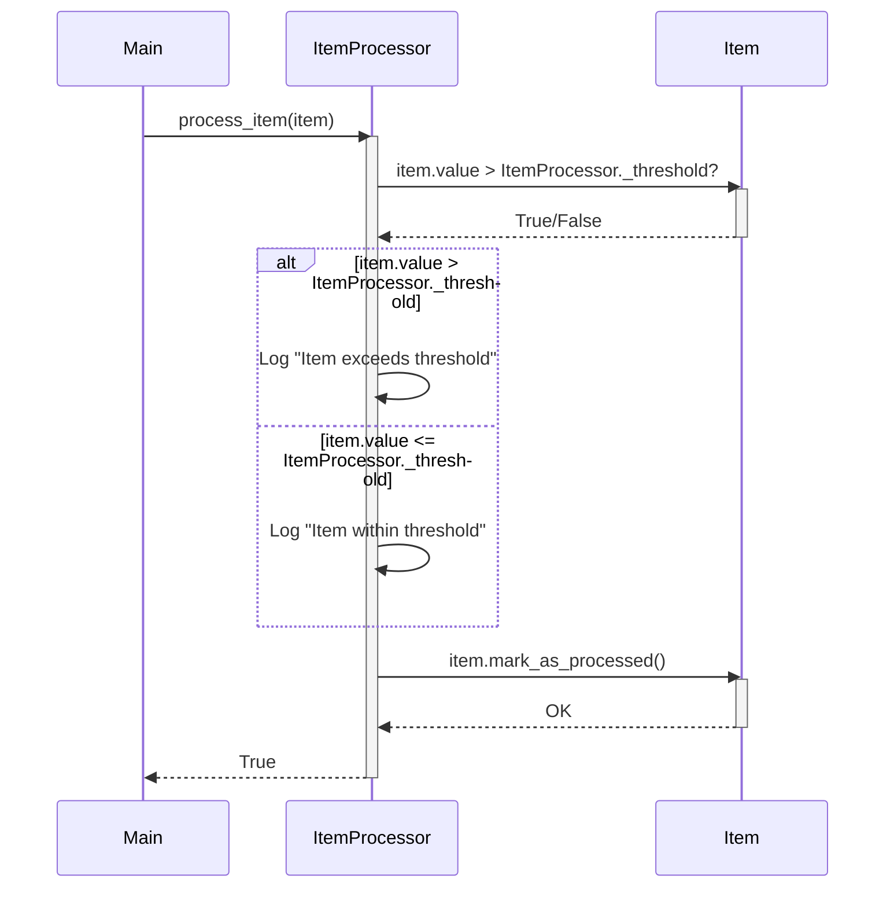

Previously, we looked at [Logging](04_logging.md).

# Chapter 5: Item Processing
Let's begin exploring this concept. This chapter will focus on how individual `Item` objects are processed within our `python_sample_project`. Our goal is to understand the core logic that transforms and manipulates our data.
**Motivation/Purpose**
Think of "Item Processing" as the engine room of our application. We've already defined the `Item` (the blueprint, as covered in [Data Model (Item)](02_data-model-item.md)), loaded the `Item` objects (the raw materials, as discussed in [Data Handling](03_data-handling.md)), and configured logging (as seen in [Logging](04_logging.md)). Now, we need to *do* something with these items.
The Item Processing component encapsulates the core business logic of our application. This might involve:
*   Applying specific rules to the `Item` based on its properties (e.g., value, name, category).
*   Modifying the `Item`'s state based on these rules.
*   Making decisions about what to do with the `Item` (e.g., approve, reject, flag for review).
By centralizing this logic into a dedicated "Item Processing" module, we achieve:
*   **Maintainability:** Changes to the processing logic are localized to a single module, making it easier to update and debug.
*   **Reusability:** The processing logic can be easily reused in different parts of the application.
*   **Testability:** It becomes easier to test the core business logic in isolation.
**Key Concepts Breakdown**
The `ItemProcessor` class is the heart of our item processing logic. Let's break down its key components:
*   **`ItemProcessor` Class:** The main class responsible for processing `Item` objects.
*   **`threshold`:** A crucial piece of configuration. The `ItemProcessor` is initialized with a `threshold` value. This threshold is used to make decisions about how to process individual `Item` objects.  This value is loaded via the [Configuration Management](01_configuration-management.md) system.
*   **`process_item` Method:** The core method that performs the actual processing of an `Item`.  It applies the logic based on the configured threshold.
*   **Logging:** The `ItemProcessor` uses the logging module ([Logging](04_logging.md)) to record its activities and any errors that occur during processing.
**Usage / How it Works**
The `ItemProcessor` works as follows:
1.  **Initialization:** An `ItemProcessor` instance is created with a specific `threshold` value.
2.  **Processing:** The `process_item` method is called for each `Item` object that needs to be processed.
3.  **Logic Application:** Inside the `process_item` method, logic is applied based on the `Item`'s properties (e.g., its `value`) and the configured `threshold`.
4.  **Action:** Based on the logic, actions are taken. In our simple example, this involves logging messages indicating whether the `Item`'s value exceeds the threshold. In a real-world application, this could involve more complex operations, such as modifying the `Item`'s state, sending notifications, or triggering other workflows.
5.  **Mark as Processed:** After the processing logic is applied, the `Item` is marked as processed using its own `mark_as_processed` method.
6.  **Result:** The `process_item` method returns a boolean value indicating whether the processing was successful.
**Code Examples (Short & Essential)**
Here's the essential part of the `item_processor.py` file:
```python
"""Contain the logic for processing Item objects in Sample Project 2."""
import logging
# Import Item model using relative imports
from .models import Item
logger: logging.Logger = logging.getLogger(__name__)
class ItemProcessor:
    """Process individual Item objects based on configured rules."""
    _threshold: int
    def __init__(self: "ItemProcessor", threshold: int) -> None:
        """Initialize the ItemProcessor with a processing threshold."""
        self._threshold = threshold
        logger.info("ItemProcessor initialized with threshold: %d", self._threshold)
    def process_item(self: "ItemProcessor", item: Item) -> bool:
        """Process a single item."""
        if not isinstance(item, Item):
            logger.error("Invalid object passed to process_item.")
            return False
        # Apply some simple logic based on the threshold
        if item.value > self._threshold:
            logger.info("Item '%s' value exceeds threshold.", item.name)
        else:
            logger.info("Item '%s' value is within threshold.", item.name)
        # Mark the item as processed using its own method
        item.mark_as_processed()
        # Simulate successful processing
        return True
```
This code snippet demonstrates the basic structure of the `ItemProcessor` and the `process_item` method. It shows how the `threshold` is used to make decisions about how to process each `Item`.
**Inline Diagrams (Optional)**
Here's a sequence diagram that illustrates the interaction between the `main.py`, `ItemProcessor`, and `Item` during the processing of a single item:

This diagram shows how `main.py` calls the `process_item` method of the `ItemProcessor`, which then interacts with the `Item` object to determine its value and mark it as processed. The conditional logic ( `alt` and `else`) demonstrates how the processor makes decisions based on the threshold.
**Relationships & Cross-Linking**
As demonstrated in the `main.py` file (partially shown in the code snippets at the start), the `ItemProcessor` class is instantiated and used within the main processing pipeline described in [Main Application Orchestration](06_main-application-orchestration.md). The configuration for the `ItemProcessor`, specifically the threshold, is managed as described in [Configuration Management](01_configuration-management.md). The `Item` objects being processed are defined in [Data Model (Item)](02_data-model-item.md).
This concludes our look at this topic.

Next, we will examine [Main Application Orchestration](06_main-application-orchestration.md).


---

*Generated by [SourceLens AI](https://github.com/darijo2yahoocom/sourceLensAI) using LLM: `gemini` (cloud) - model: `gemini-2.0-flash` | Language Profile: `Python`*