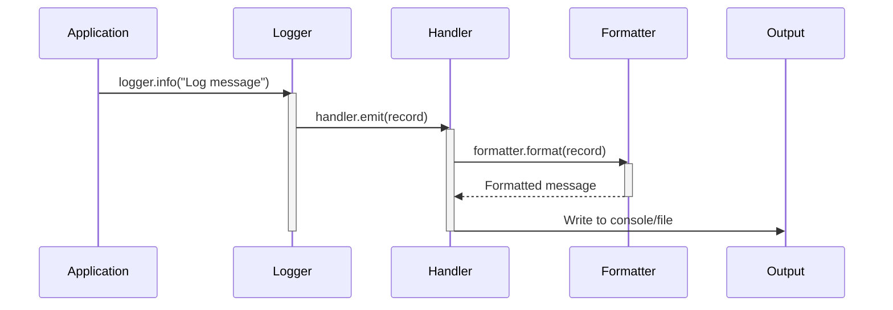

Previously, we looked at [Item Processing](04_item-processing.md).

# Chapter 5: Logging
Let's begin exploring this concept. The goal of this chapter is to understand how logging is implemented in `python_sample_project`, why it's important, and how you can use it to debug and monitor the application.
## Why Logging?
Imagine you're driving a car without a dashboard. You wouldn't know your speed, fuel level, or if the engine is overheating! Logging in software is similar to a car's dashboard. It provides insights into what the application is doing, what errors are occurring, and helps you understand the application's health.
Logging is crucial for:
*   **Debugging:** Tracing the execution flow and identifying the root cause of problems.
*   **Monitoring:** Tracking application performance and identifying potential issues before they become critical.
*   **Auditing:** Recording important events for security and compliance purposes.
## Key Concepts
The `logging` module in Python provides a flexible and powerful way to implement logging in your applications. Here are the key concepts:
*   **Loggers:** The entry point for logging messages. You create a logger instance for each module or class where you want to log information.
*   **Log Levels:** Represent the severity of a log message. Common levels include DEBUG, INFO, WARNING, ERROR, and CRITICAL.
*   **Handlers:** Determine where log messages are sent (e.g., console, file, email).
*   **Formatters:** Define the structure and content of log messages.
## How it Works in `python_sample_project`
In `python_sample_project`, the `logging` module is used throughout the codebase. Each module (like `data_handler.py` and `item_processor.py`) gets its own logger instance using `logging.getLogger(__name__)`. This ensures that log messages are easily traceable to their origin.
The `main.py` script sets up the basic logging configuration using `logging.basicConfig()`. This configures the root logger to output messages to the console with a specific format and log level. The log level is read from the configuration file (see [Configuration Management](01_configuration-management.md)).
Here's a breakdown of how logging is used in the project:
1.  **Import the `logging` module:**
    ```python
    import logging
    ```
2.  **Get a logger instance:**
    ```python
    logger: logging.Logger = logging.getLogger(__name__)
    ```
    `__name__` is a special variable that holds the name of the current module (e.g., `"data_handler"`). This helps identify the source of log messages.
3.  **Log messages at different levels:**
    ```python
    logger.debug("This is a debug message.")
    logger.info("This is an info message.")
    logger.warning("This is a warning message.")
    logger.error("This is an error message.")
    logger.critical("This is a critical message.")
    ```
The configured log level in `main.py` (set via the `LOG_LEVEL` setting, see [Configuration Management](01_configuration-management.md)) determines which messages are actually displayed. For example, if the log level is set to `INFO`, only INFO, WARNING, ERROR, and CRITICAL messages will be shown; DEBUG messages will be suppressed.
## Code Examples
Here are a few examples of how logging is used in different modules:
*   **`data_handler.py`:** Logs information about data loading and saving operations.
    ```python
    logger.info("DataHandler initialized for source: %s", self._data_source)
    logger.info("Loaded %d items.", len(items))
    logger.debug("Saving item: %s", item)
    ```
*   **`item_processor.py`:** Logs details about item processing, including when an item's value exceeds the configured threshold.
    ```python
    logger.info("ItemProcessor initialized with threshold: %d", self._threshold)
    logger.debug(
        "Processing item ID: %d, Name: '%s', Value: %.2f",
        item.item_id,
        item.name,
        item.value,
    )
    ```
*   **`main.py`:** Logs the overall flow of the application, including startup, shutdown, and any errors that occur.
    ```python
    logger.info("Starting Sample Project 2 processing pipeline...")
    logger.warning("No items loaded from data source. Exiting pipeline.")
    logger.error("Failed to process item: %s", item)
    ```
## Logging Levels
The different logging levels allow you to control the verbosity of the logging output. Here's a summary of the levels used in `python_sample_project`:
*   **DEBUG:** Detailed information, typically used for debugging purposes.
*   **INFO:** General information about the application's state.
*   **WARNING:** Indicates a potential problem or unexpected event.
*   **ERROR:** Indicates a more serious problem that may prevent the application from functioning correctly.
*   **CRITICAL:** Indicates a critical error that may lead to application termination.
## Logging Flow
Here's a simple sequence diagram showing how a log message is generated and handled within the application:

This diagram illustrates the flow: The application calls a logging method (like `logger.info`). The logger passes the log record to a handler. The handler uses a formatter to create a formatted string and then outputs the message to the configured destination (e.g., the console or a file).
## Exception Handling and Logging
It is critical to log exceptions that occur during the application execution. The `main.py` file demonstrates how to catch exceptions and log them using `logger.critical` along with `exc_info=True`.
```python
    except FileNotFoundError as e:
        logger.critical("Configuration error: Data file path not found. %s", e, exc_info=True)
```
The `exc_info=True` argument tells the logger to include the exception traceback in the log message, which is essential for debugging.
## Best Practices
*   **Use meaningful log messages:** Provide enough context so that you or others can understand the message later.
*   **Use appropriate log levels:** Choose the log level that accurately reflects the severity of the event.
*   **Avoid logging sensitive information:** Be careful not to log passwords, API keys, or other confidential data.
*   **Configure logging properly:** Ensure that logging is configured correctly for different environments (e.g., development, testing, production). See [Configuration Management](01_configuration-management.md) for how `LOG_LEVEL` is set.
*   **Regularly review logs:** Make sure you're actively monitoring the logs to identify and address potential problems.
This concludes our look at this topic.

Next, we will examine [Main Application Pipeline](06_main-application-pipeline.md).


---

*Generated by [SourceLens AI](https://github.com/darijo2yahoocom/sourceLensAI) using LLM: `gemini` (cloud) - model: `gemini-2.0-flash` | Language Profile: `python`*