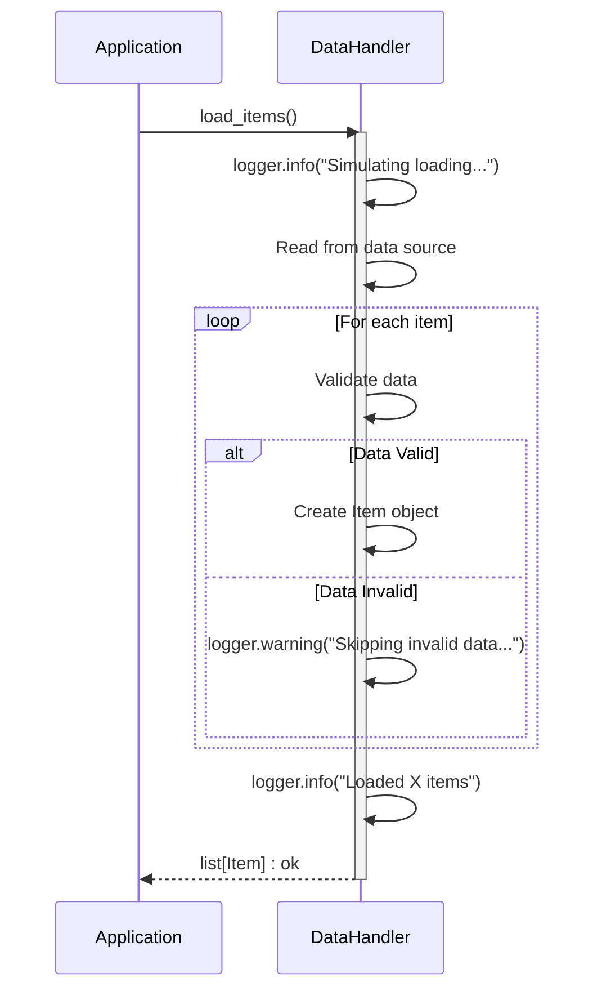

Previously, we looked at [Item Processing](04_item-processing.md).

# Chapter 5: Logging
Let's begin exploring this concept. In this chapter, we'll cover how to implement logging within our application to record important information and aid in debugging.
Why do we need logging? Imagine trying to understand why a complex machine isn't working correctly without any gauges, lights, or diagnostic readouts. Logging is similar to installing these indicators in our software. It provides a record of what happened, when it happened, and whether any errors occurred. Without logging, debugging can be a difficult and time-consuming process of guesswork. With good logs, you can quickly pinpoint the source of a problem.
## Key Concepts
At its core, logging involves recording messages about events that happen during the execution of a program. These messages can range from informational messages ("Application started") to warnings ("Low disk space") and errors ("Failed to connect to database").
Here are the key concepts in Python's `logging` module:
*   **Loggers:** The entry point for logging. Applications create logger instances to record messages.
*   **Levels:** Indicate the severity of a log message (e.g., DEBUG, INFO, WARNING, ERROR, CRITICAL).
*   **Handlers:** Determine where log messages are sent (e.g., console, file, email).
*   **Formatters:** Specify the layout of log messages (e.g., including timestamp, level, and message).
## Usage / How it Works
The basic workflow for logging is:
1.  **Get a logger:**  Create a logger instance using `logging.getLogger(__name__)`.  `__name__` is a Python built-in variable that contains the name of the current module.
2.  **Set the level:** Configure the logger to only process messages of a certain severity or higher (e.g., `logging.INFO` would log INFO, WARNING, ERROR, and CRITICAL messages, but not DEBUG).  This is often handled in a central configuration step.
3.  **Add handlers (optional):** If you want to send log messages to a file (or somewhere other than the console), you add a handler.  The handler determines *where* the message goes.
4.  **Create formatters (optional):** If you want a specific layout for your logs, you create a formatter and attach it to your handler. The formatter determines *how* the message looks.
5.  **Log messages:** Use methods like `logger.debug()`, `logger.info()`, `logger.warning()`, `logger.error()`, and `logger.critical()` to record messages at the appropriate level.
## Code Examples
Here's how logging is implemented in our project:
```python
--- File: data_handler.py ---
import logging
# Use standard logging
logger: logging.Logger = logging.getLogger(__name__)
class DataHandler:
    def __init__(self: "DataHandler", data_source_path: str) -> None:
        self._data_source = data_source_path
        logger.info("DataHandler initialized for source: %s", self._data_source)
    def load_items(self: "DataHandler") -> list[Item]:
        logger.info("Simulating loading items from %s...", self._data_source)
        # ... rest of the code ...
    def save_items(self: "DataHandler", items: list[Item]) -> bool:
        logger.info("Simulating saving %d items to %s...", len(items), self._data_source)
        # ... rest of the code ...
```
This snippet from `data_handler.py` demonstrates how to get a logger instance and use it to record informational messages when the `DataHandler` is initialized and when items are loaded and saved. The `%s` is used for string formatting, inserting the value of `self._data_source` and other variables into the log message.
Similarly, the `item_processor.py` file utilizes logging for debugging and providing insights into item processing:
```python
--- File: item_processor.py ---
import logging
# Use standard logging
logger: logging.Logger = logging.getLogger(__name__)
class ItemProcessor:
    def __init__(self: "ItemProcessor", threshold: int) -> None:
        self._threshold = threshold
        logger.info("ItemProcessor initialized with threshold: %d", self._threshold)
    def process_item(self: "ItemProcessor", item: Item) -> bool:
        if not isinstance(item, Item):
            logger.error(
                "Invalid object passed to process_item. Expected Item, got %s.",
                type(item).__name__,
            )
            return False
        # ... rest of the code ...
```
This example shows how logging can be used to record errors, such as when an invalid object is passed to the `process_item` method.  The `%d` is used for integer formatting, inserting the value of `self._threshold` into the log message.
The `main.py` file sets up basic logging and uses it to track the progress of the data processing pipeline:
```python
--- File: main.py ---
import logging
def setup_main_logging() -> None:
    logging.basicConfig(
        level=getattr(logging, config.LOG_LEVEL.upper(), logging.INFO),
        format="%(asctime)s - %(name)s - %(levelname)s - %(message)s",
    )
def run_processing_pipeline() -> None:
    logger: logging.Logger = logging.getLogger(__name__)
    logger.info("Starting Sample Project 2 processing pipeline...")
    # ... rest of the code ...
```
Here, `logging.basicConfig()` is used to configure basic logging, including setting the log level and format.  `getattr()` is used to retrieve the logging level from the configuration, ensuring flexibility in setting the desired verbosity.
## Relationships & Cross-Linking
Logging relies on the [Configuration Management](01_configuration-management.md) to determine the log level.  It is used throughout the [Data Handling](03_data-handling.md) and [Item Processing](04_item-processing.md) modules.
## Example Diagram
Here is a simplified sequence diagram showing how logging messages might flow in the `DataHandler`:

This diagram illustrates how the `DataHandler` logs messages at different stages of the `load_items()` method, providing visibility into the loading process and potential data validation issues.  Note how every arrow has a label following the colon.
This concludes our look at this topic.

Next, we will examine [Main Application Orchestration](06_main-application-orchestration.md).


---

*Generated by [SourceLens AI](https://github.com/darijo2yahoocom/sourceLensAI) using LLM: `gemini` (cloud) - model: `gemini-2.0-flash` | Language Profile: `python`*