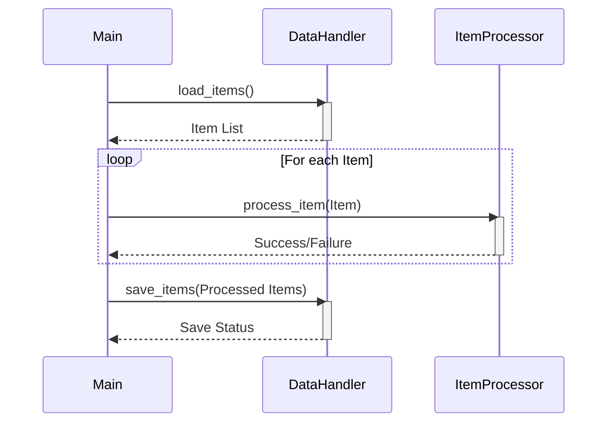

Previously, we looked at [Item Processing](05_item-processing.md).

# Chapter 6: Main Application Orchestration
Let's begin exploring this concept. The goal of this chapter is to understand how the `main.py` script orchestrates the entire data processing pipeline in `python_sample_project`. We will examine its role as the application's entry point and how it manages the flow of data.
**Motivation/Purpose**
Think of `main.py` as the conductor of an orchestra. It doesn't play any instruments itself (it doesn't directly load, process, or save data), but it tells each instrument (component) when and how to play (perform its specific task). Without a conductor, the orchestra (data processing pipeline) would be chaotic and disorganized. `main.py` provides the structure and control necessary for the application to function correctly. It's the single point of execution, ensuring that everything happens in the right order and that errors are handled gracefully.
**Key Concepts Breakdown**
The `main.py` script performs several key functions:
1.  **Initialization:** It initializes the necessary components, like the `DataHandler` and `ItemProcessor`, using configuration settings. This involves reading values from the configuration (as detailed in [Configuration Management](01_configuration-management.md)).
2.  **Data Loading:** It uses the `DataHandler` to load data items from a source (e.g., a file).
3.  **Item Processing:** It iterates through the loaded items and uses the `ItemProcessor` to process each item. Details about item processing are in [Item Processing](05_item-processing.md).
4.  **Result Saving:** It uses the `DataHandler` to save the processed data items.
5.  **Error Handling:** It includes a `try...except` block to catch potential errors during the pipeline execution, ensuring that the application doesn't crash unexpectedly. It uses the logging module (discussed in [Logging](04_logging.md)) to record errors and other relevant information.
6.  **Logging:** It sets up logging to track the progress of the pipeline and any errors that occur.
**Usage / How it Works**
The `main.py` script is designed to be executed directly. When run, it performs the steps described above in sequence. The `run_processing_pipeline()` function encapsulates the core logic of the data processing pipeline.  The script starts by setting up logging using `setup_main_logging()`. After that, the `run_processing_pipeline()` function is invoked. This function loads the configuration values, instantiates `DataHandler` and `ItemProcessor`, loads data, processes items, saves the results, and handles potential exceptions during any of these steps.
**Code Examples (Short & Essential)**
Here's a snippet showcasing the core processing loop within `run_processing_pipeline()`:
```python
--- File: main.py ---
processed_items: list[Item] = []
failed_items: list[Item] = []
for item in items_to_process:
    logger.debug("Passing item to processor: %s", item)
    success: bool = item_processor.process_item(item)
    if success:
        processed_items.append(item)
    else:
        logger.error("Failed to process item: %s", item)
        failed_items.append(item)
```
This loop iterates through each loaded item, attempts to process it using `item_processor.process_item()`, and tracks successful and failed items separately. This example shows how `main.py` manages the flow of individual data items through the processing pipeline.
Here is another snippet that shows how the data processing pipeline handles errors by using `try...except` and logs any occurring exceptions.
```python
--- File: main.py ---
    try:
        # Pipeline Steps here ...
    except FileNotFoundError as e:
        logger.critical("Configuration error: Data file path not found. %s", e, exc_info=True)
    except OSError as e:
        # Catches other OS-related errors (broader I/O issues beyond file not found)
        logger.critical(
            "An OS or I/O error occurred during pipeline execution: %s",
            e,
            exc_info=True,
        )
    except (ValueError, TypeError, AttributeError, KeyError) as e:
        # Catches common data processing or programming errors
        logger.critical("A runtime error occurred during pipeline execution: %s", e, exc_info=True)
```
**Inline Diagrams (Optional)**
Here's a simplified sequence diagram illustrating the interaction between `main.py` and the other components:

This diagram shows how `main.py` initiates the loading and saving of data using the `DataHandler` and delegates the processing of individual items to the `ItemProcessor`. The loop highlights that this processing occurs for each item in the data.
**Relationships & Cross-Linking**
As mentioned earlier, this chapter builds upon the concepts discussed in [Configuration Management](01_configuration-management.md), [Data Model (Item)](02_data-model-item.md), [Data Handling](03_data-handling.md), [Logging](04_logging.md), and [Item Processing](05_item-processing.md). Understanding how these components interact is crucial for comprehending the overall functionality of the application.
**Conclusion**
In this chapter, we examined the role of `main.py` as the central orchestrator of the data processing pipeline. We discussed how it initializes components, loads data, processes items, saves results, and handles errors.  `main.py` provides the necessary structure and control for the application to function correctly.
This concludes our look at this topic.

Next, we will examine [Architecture Diagrams](07_diagrams.md).


---

*Generated by [SourceLens AI](https://github.com/darijo2yahoocom/sourceLensAI) using LLM: `gemini` (cloud) - model: `gemini-2.0-flash` | Language Profile: `Python`*