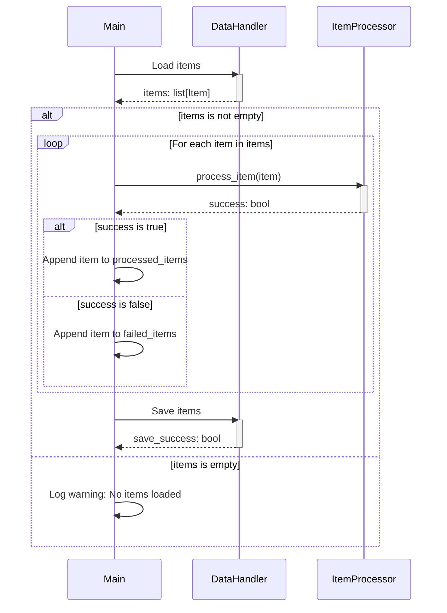

Previously, we looked at [Logging](05_logging.md).

# Chapter 6: Main Application Orchestration
Let's begin exploring this concept. In this chapter, we'll delve into the heart of our application: the main orchestration logic. Our goal is to understand how all the individual pieces we've built so far—configuration, data models, data handling, item processing, and logging—come together to form a functional application.
## Motivation and Purpose
Think of the main application orchestration as the conductor of an orchestra. Each instrument (our components) is capable of playing beautiful music on its own, but it's the conductor who brings them together, ensures they play in harmony, and guides them to create a complete and meaningful symphony (our data processing pipeline).
Without this orchestration, our components would simply exist in isolation, never fulfilling their potential to work together and achieve our desired outcome. The main orchestration ties everything together.
## Key Concepts Breakdown
The main application orchestration typically involves these key steps:
1.  **Initialization:** Loading configuration settings and creating instances of our `DataHandler` and `ItemProcessor`.
2.  **Data Loading:** Using the `DataHandler` to load the data (our "items") that we want to process.
3.  **Data Processing:** Iterating through the loaded items and using the `ItemProcessor` to apply our processing logic to each item.
4.  **Result Saving:** Using the `DataHandler` to save the processed items.
5.  **Error Handling:** Gracefully handling potential errors that may occur during any of these steps.
6.  **Logging:** Recording events and potential problems during the entire process to monitor and debug.
## Usage / How it Works
The orchestration logic resides within the `run_processing_pipeline` function in our `main.py` file. This function defines the sequence of operations that our application will perform: load data, process it, and save the result, all the while handling potential errors and logging useful information.
## Code Examples (Short & Essential)
Here's a snippet of how the orchestration is implemented in `main.py`:
```python
--- File: main.py ---
def run_processing_pipeline() -> None:
    """Execute the main data processing pipeline."""
    logger: logging.Logger = logging.getLogger(__name__)  # Get logger instance for this function
    logger.info("Starting Sample Project 2 processing pipeline...")
    try:
        # 1. Initialize components using configuration
        data_path: str = config.get_data_path()
        threshold: int = config.get_threshold()
        data_handler = DataHandler(data_source_path=data_path)
        item_processor = ItemProcessor(threshold=threshold)
        # 2. Load data
        items_to_process: list[Item] = data_handler.load_items()
        if not items_to_process:
            logger.warning("No items loaded from data source. Exiting pipeline.")
            return
        logger.info("Successfully loaded %d items.", len(items_to_process))
        # 3. Process data items
        processed_items: list[Item] = []
        failed_items: list[Item] = []
        for item in items_to_process:
            logger.debug("Passing item to processor: %s", item)
            success: bool = item_processor.process_item(item)
            if success:
                processed_items.append(item)
            else:
                logger.error("Failed to process item: %s", item)
                failed_items.append(item)  # Keep track of failed items if needed
        logger.info(
            "Processed %d items successfully, %d failed.",
            len(processed_items),
            len(failed_items),
        )
        # 4. Save processed data
        save_success: bool = data_handler.save_items(items_to_process)
        if save_success:
            logger.info("Processed items saved successfully.")
        else:
            logger.error("Failed to save processed items.")
    except FileNotFoundError as e:
        logger.critical("Configuration error: Data file path not found. %s", e, exc_info=True)
    except OSError as e:
        # Catches other OS-related errors (broader I/O issues beyond file not found)
        logger.critical(
            "An OS or I/O error occurred during pipeline execution: %s",
            e,
            exc_info=True,
        )
    except (ValueError, TypeError, AttributeError, KeyError) as e:
        # Catches common data processing or programming errors
        logger.critical("A runtime error occurred during pipeline execution: %s", e, exc_info=True)
    # Note: No generic `except Exception as e:` to comply with strict BLE001.
    # Any other unhandled exceptions will terminate the program.
    finally:
        logger.info("Sample Project 2 processing pipeline finished.")
```
This code clearly shows the sequence of loading, processing, and saving items, alongside comprehensive error handling and logging.
## Inline Diagrams (Optional)
Here's a sequence diagram visualizing the main processing flow:

The diagram illustrates how the `Main` component interacts with the `DataHandler` and `ItemProcessor` to load, process, and save items, including the loop for processing each individual item.
## Relationships & Cross-Linking
This chapter builds upon the concepts introduced in the previous chapters: [Configuration Management](01_configuration-management.md), [Data Model (Item)](02_data-model-item.md), [Data Handling](03_data-handling.md), [Item Processing](04_item-processing.md), and [Logging](05_logging.md). It brings all these components together to create a working application.
## Tone & Style
The main application orchestration is like the glue that holds our application together. It's the central point of control that coordinates all the different components and ensures that they work together seamlessly. By understanding this orchestration logic, you gain a complete view of how our application functions.
## Conclusion
In this chapter, we explored the crucial role of main application orchestration, examining how it unifies various components to create a functional data processing pipeline. We covered loading data, processing items, saving results, and the importance of error handling and logging.
This concludes our look at this topic.

Next, we will examine [Architecture Diagrams](07_diagrams.md).


---

*Generated by [SourceLens AI](https://github.com/darijo2yahoocom/sourceLensAI) using LLM: `gemini` (cloud) - model: `gemini-2.0-flash` | Language Profile: `python`*