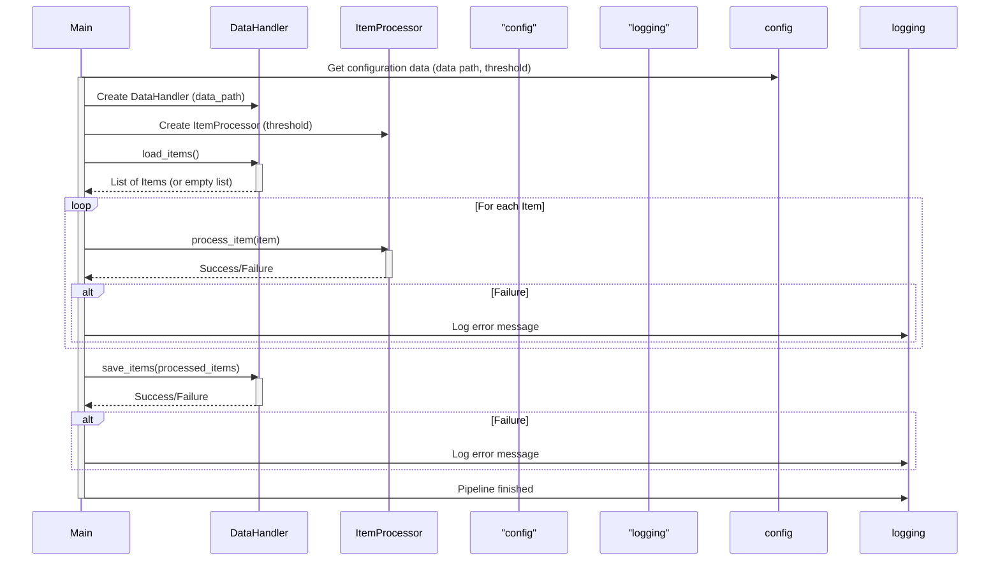

Previously, we looked at [Logging](05_logging.md).

# Chapter 6: Main Application Pipeline
Let's begin exploring this concept. This chapter explains the core `python_sample_project` pipeline responsible for loading, processing, and saving data. The goal is to understand how all components work together.
The Main Application Pipeline is like the conductor of an orchestra. It doesn't play any instruments (perform the actual data processing) itself, but it coordinates all the different sections (components) to create a harmonious piece (a complete data processing cycle). Without the conductor, the orchestra would just be a collection of musicians playing their own tunes! Similarly, without the pipeline, the individual data handling and processing components wouldn't know when or how to work together to achieve the project's objective.
The pipeline's purpose is to:
*   **Initialize**: Set up the necessary components like the [Data Handling](03_data-handling.md) and [Item Processing](04_item-processing.md) modules, using configurations defined in [Configuration Management](01_configuration-management.md).
*   **Load Data**: Retrieve data items from the source using the `DataHandler`.
*   **Process Data**: Iterate through each data item and apply the processing logic using the `ItemProcessor`.
*   **Save Data**: Store the processed data back to the desired location.
*   **Handle Errors**: Gracefully manage any exceptions that occur during the process, ensuring the application doesn't crash and providing informative error messages via [Logging](05_logging.md).
*   **Logging**: Provide detailed information on the progress and status of the pipeline, utilizing the logging module for debugging and monitoring.
The main components involved are:
*   `DataHandler`: Responsible for loading and saving data.
*   `ItemProcessor`: Responsible for processing individual data items according to defined rules.
*   `config`: The configuration module defines paths, thresholds, and other settings.
*   `logging`: The module for reporting activity and errors.
*   `Item` (model): The data structure representing a data item (see [Data Model (Item)](02_data-model-item.md)).
Here's how the pipeline generally works:
1.  **Initialization**: The pipeline retrieves configuration settings (like the data file path and processing threshold). It then creates instances of the `DataHandler` and `ItemProcessor`, passing in the configuration values.
2.  **Data Loading**: The `DataHandler`'s `load_items()` method is called to read the data from the configured source (e.g., a file).
3.  **Data Processing**: The pipeline iterates through the loaded data items. For each item, it calls the `ItemProcessor`'s `process_item()` method.
4.  **Data Saving**: After processing all items, the `DataHandler`'s `save_items()` method is called to persist the processed data.
5.  **Error Handling**: The entire process is wrapped in a `try...except` block to catch potential exceptions (e.g., file not found, invalid data). If an exception occurs, it's logged, and the program attempts to exit gracefully.
The following sequence diagram illustrates the interaction between the main components:

This diagram shows how the `Main` application interacts with the `config`, `DataHandler`, `ItemProcessor`, and `logging` components during the pipeline execution.
Here's the relevant section of `main.py` that embodies the pipeline logic:
```python
--- File: main.py ---
def run_processing_pipeline() -> None:
    """Execute the main data processing pipeline."""
    logger: logging.Logger = logging.getLogger(__name__)  # Get logger instance for this function
    logger.info("Starting Sample Project 2 processing pipeline...")
    try:
        # 1. Initialize components using configuration
        data_path: str = config.get_data_path()
        threshold: int = config.get_threshold()
        data_handler = DataHandler(data_source_path=data_path)
        item_processor = ItemProcessor(threshold=threshold)
        # 2. Load data
        items_to_process: list[Item] = data_handler.load_items()
        if not items_to_process:
            logger.warning("No items loaded from data source. Exiting pipeline.")
            return
        logger.info("Successfully loaded %d items.", len(items_to_process))
        # 3. Process data items
        processed_items: list[Item] = []
        failed_items: list[Item] = []
        for item in items_to_process:
            logger.debug("Passing item to processor: %s", item)
            success: bool = item_processor.process_item(item)
            if success:
                processed_items.append(item)
            else:
                logger.error("Failed to process item: %s", item)
                failed_items.append(item)  # Keep track of failed items if needed
        logger.info(
            "Processed %d items successfully, %d failed.",
            len(processed_items),
            len(failed_items),
        )
        # 4. Save processed data
        save_success: bool = data_handler.save_items(items_to_process)
        if save_success:
            logger.info("Processed items saved successfully.")
        else:
            logger.error("Failed to save processed items.")
    except FileNotFoundError as e:
        logger.critical("Configuration error: Data file path not found. %s", e, exc_info=True)
    except OSError as e:
        # Catches other OS-related errors (broader I/O issues beyond file not found)
        logger.critical(
            "An OS or I/O error occurred during pipeline execution: %s",
            e,
            exc_info=True,
        )
    except (ValueError, TypeError, AttributeError, KeyError) as e:
        # Catches common data processing or programming errors
        logger.critical("A runtime error occurred during pipeline execution: %s", e, exc_info=True)
    # Note: No generic `except Exception as e:` to comply with strict BLE001.
    # Any other unhandled exceptions will terminate the program.
    finally:
        logger.info("Sample Project 2 processing pipeline finished.")
```
This code snippet shows the sequence of operations: initialization, data loading, item processing, and data saving. It also demonstrates how exceptions are caught and logged for debugging.
This concludes our look at this topic.

Next, we will examine [Architecture Diagrams](07_diagrams.md).


---

*Generated by [SourceLens AI](https://github.com/darijo2yahoocom/sourceLensAI) using LLM: `gemini` (cloud) - model: `gemini-2.0-flash` | Language Profile: `python`*