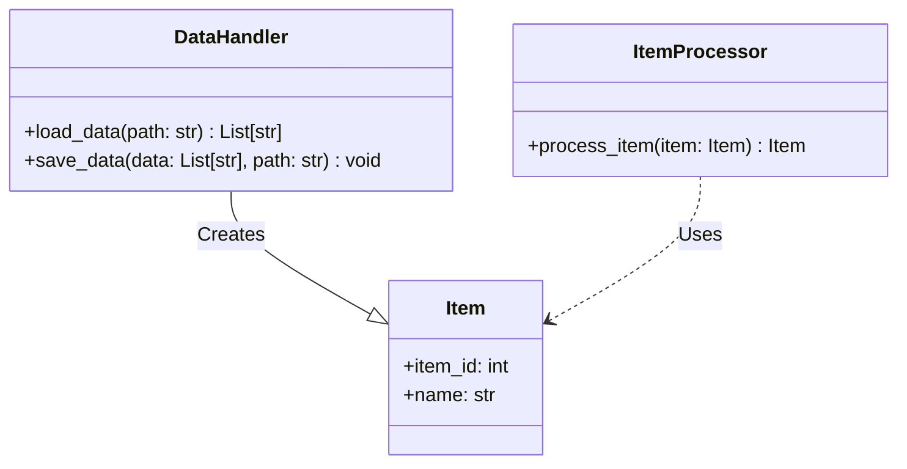
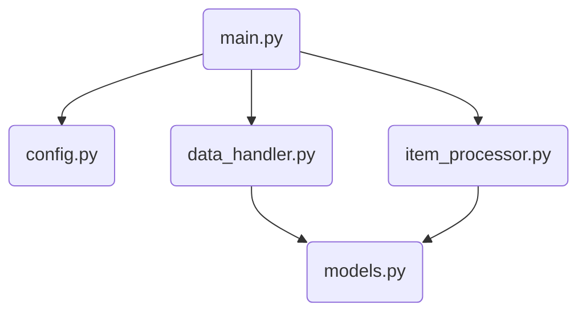
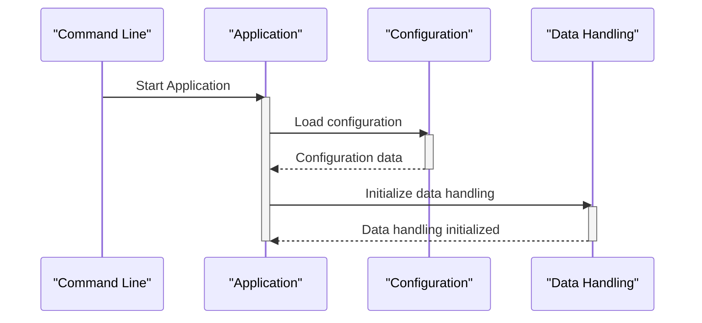
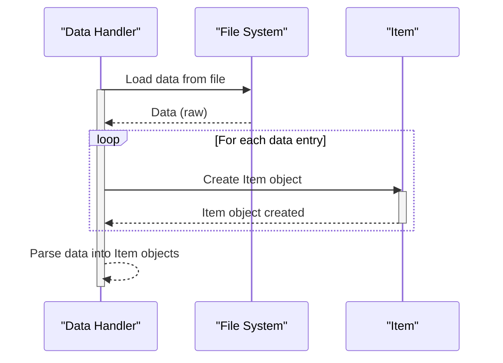
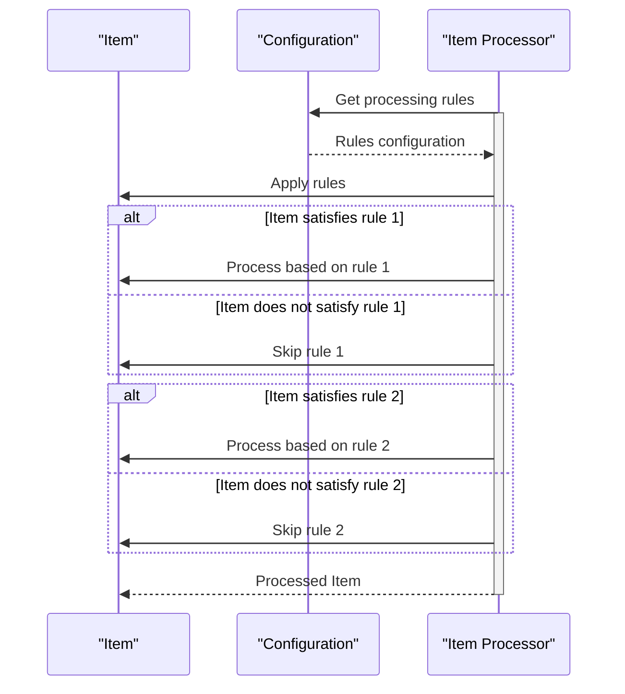
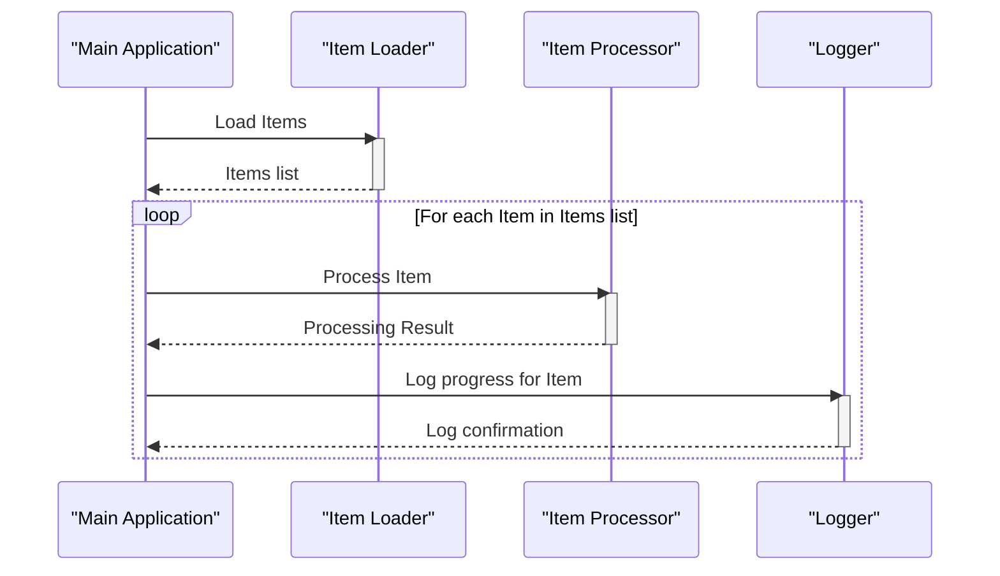
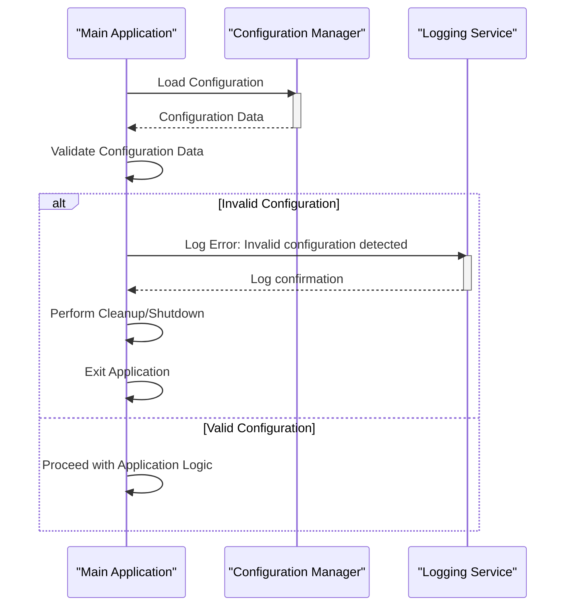

Previously, we looked at [Main Application Orchestration](06_main-application-orchestration.md).

# Architecture Diagrams
## Class Diagram
Key classes in **python_sample_project**, attributes, methods, relationships.

## Package Dependencies
High-level modular structure of **python_sample_project** and dependencies.

## Sequence Diagrams
These diagrams illustrate various interaction scenarios within the application, showcasing the sequence of operations between different components for specific use cases.
### Application starts, loads configuration, and initializes data handling.

### Data Handler loads and parses data from a file into Item objects.

### Item Processor applies processing rules to an Item based on configuration.

### Main Application orchestrates the processing of all loaded Item objects, logging progress.

### Application encounters an invalid configuration setting and gracefully shuts down.

Next, we will examine [Code Inventory](08_code_inventory.md).

---

*Generated by [SourceLens AI](https://github.com/darijo2yahoocom/sourceLensAI) using LLM: `gemini` (cloud) - model: `gemini-2.0-flash` | Language Profile: `python`*