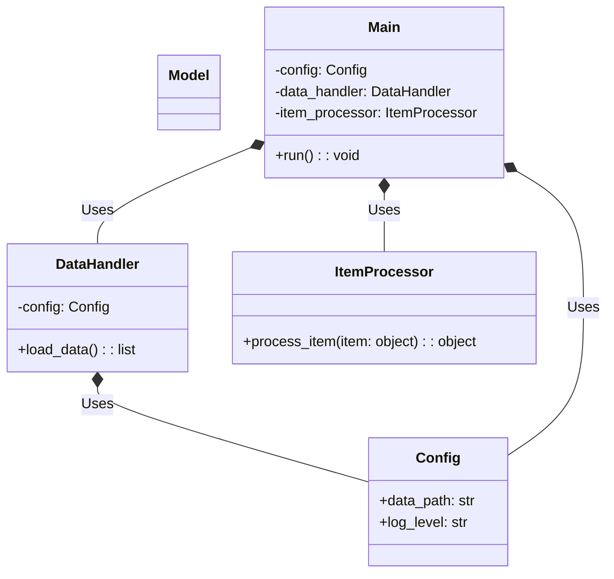
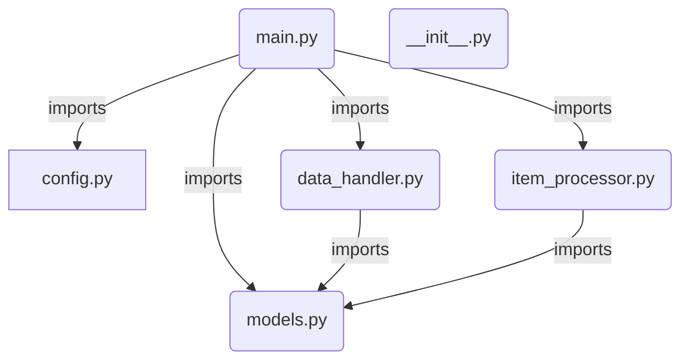
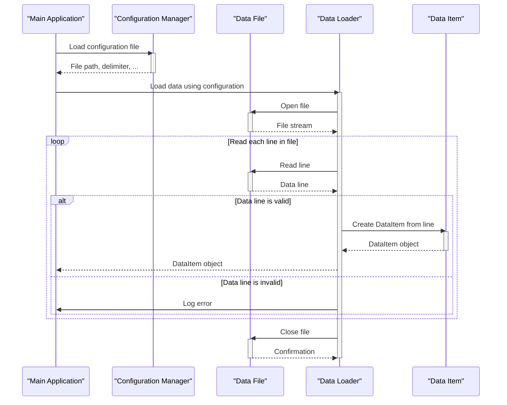
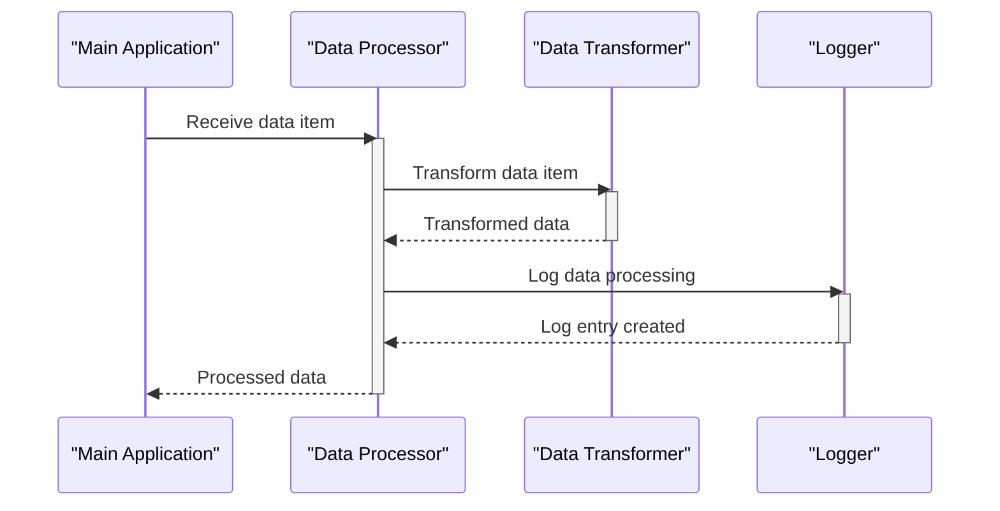
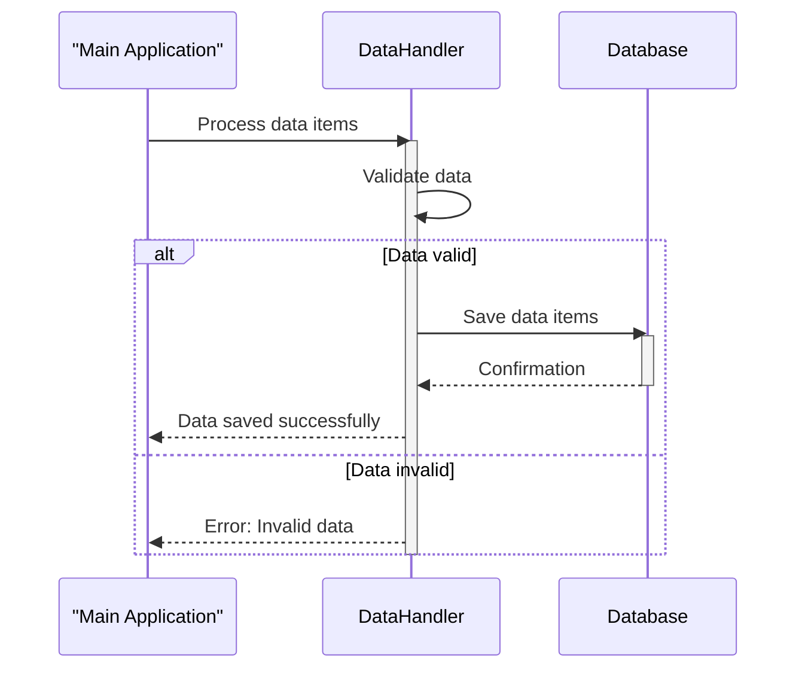
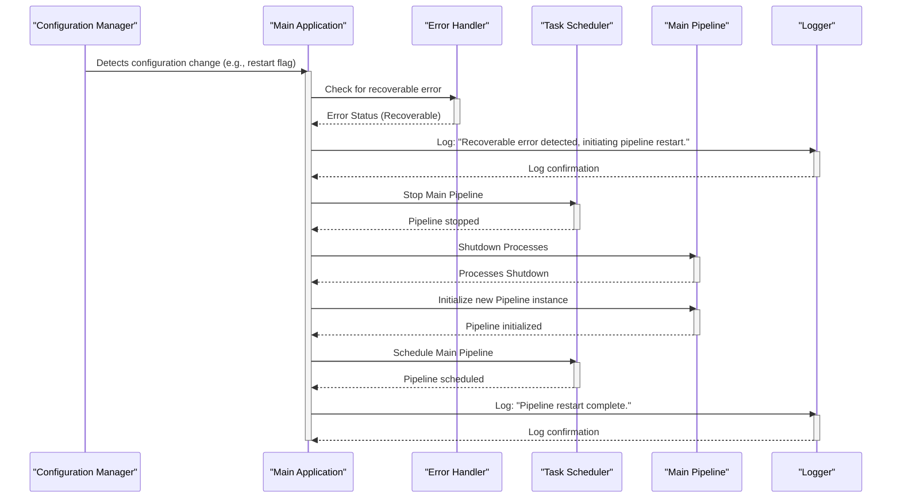

Previously, we looked at [Main Application Pipeline](06_main-application-pipeline.md).

# Architecture Diagrams
## Class Diagram
Key classes and their relationships in **python_sample_project**.

## Package Dependencies
High-level module and package structure of **python_sample_project**.

## Sequence Diagrams
These diagrams illustrate various interaction scenarios within the application, showcasing the sequence of operations between different components for specific use cases.
### Loading data items from a file based on a configuration specified in a configuration file.

### Processing a single data item through the entire pipeline, including transformation and logging.

### Saving processed data items to a database using Data Handling.

### Handling a data validation error during Item Processing and logging the error.
```mermaid
sequenceDiagram
    participant MainApp as "Main Application"
    participant ItemProc as "Item Processor"
    participant Validator as "Data Validator"
    participant Logger
    MainApp->>ItemProc: Process item data
    activate ItemProc
    ItemProc->>Validator: Validate item data
    activate Validator
    alt Data is invalid
        Validator-->>ItemProc: Validation error
        deactivate Validator
        ItemProc->>Logger: Log validation error
        activate Logger
        Logger-->>ItemProc: Error logged
        deactivate Logger
        ItemProc-->>MainApp: Error: Data validation failed
        deactivate ItemProc
    else Data is valid
        Validator-->>ItemProc: Validated data
        deactivate Validator
        ItemProc-->>MainApp: Item processed successfully
        deactivate ItemProc
    end
```
### Restarting the Main Application Pipeline after a recoverable error, triggered by Configuration Management.


Next, we will examine [Code Inventory](08_code_inventory.md).


---

*Generated by [SourceLens AI](https://github.com/darijo2yahoocom/sourceLensAI) using LLM: `gemini` (cloud) - model: `gemini-2.0-flash` | Language Profile: `python`*