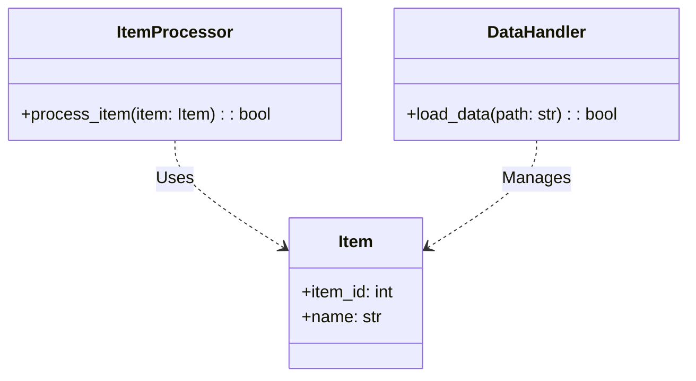
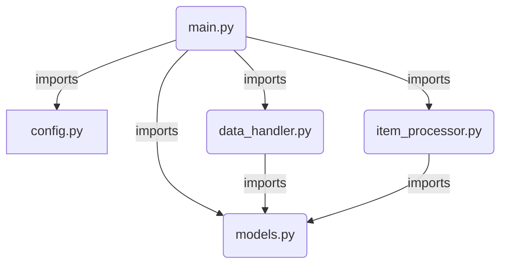
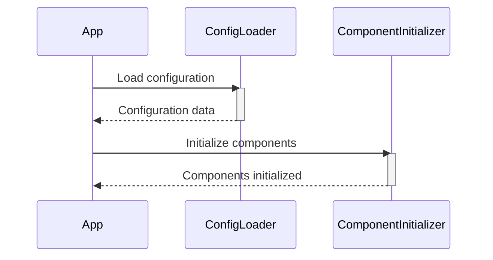
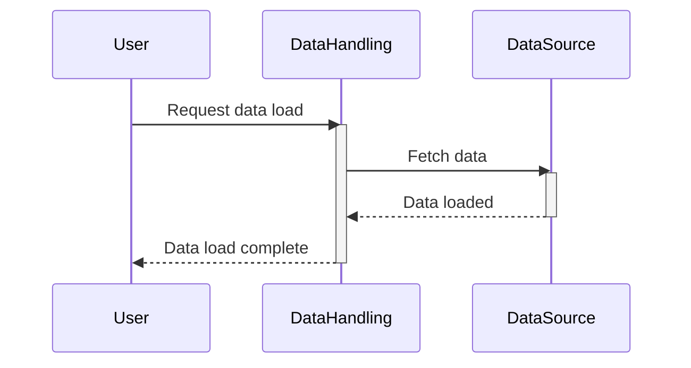
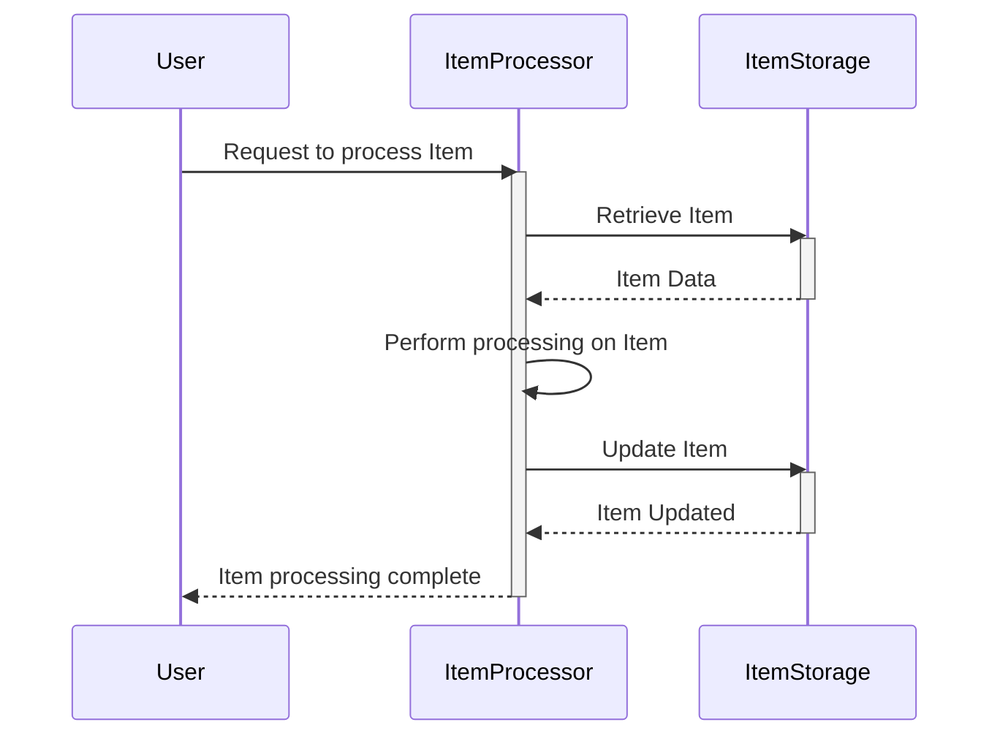
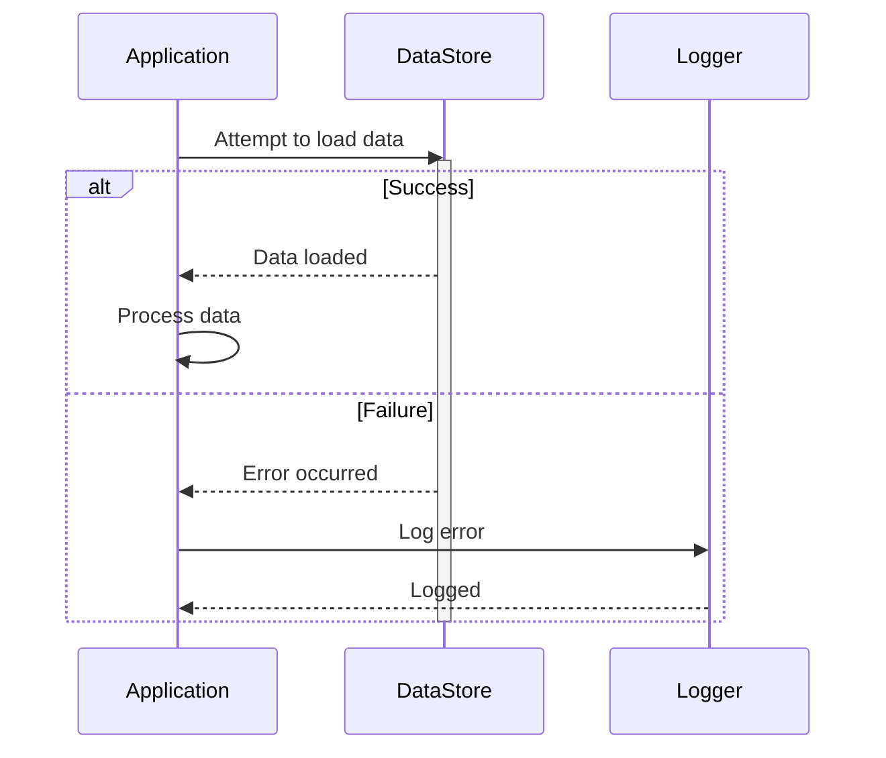
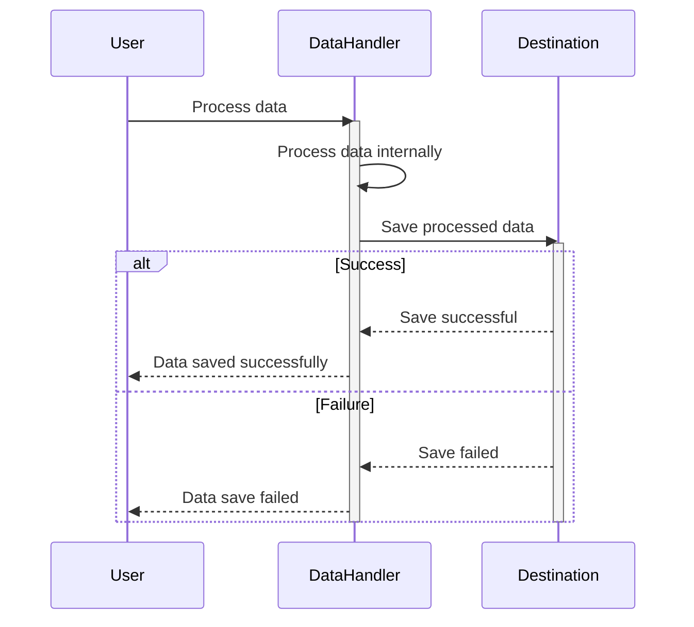

Previously, we looked at [Main Application Orchestration](06_main-application-orchestration.md).

# Architecture Diagrams
## Class Diagram
Key classes and their relationships in **python_sample_project**.

## Package Dependencies
High-level module and package structure of **python_sample_project**.

## Sequence Diagrams
These diagrams illustrate various interaction scenarios within the application, showcasing the sequence of operations between different components for specific use cases.
### The application starts, loads configuration, and initializes components.

### Data is loaded from a specified source using Data Handling.

### A single Item undergoes processing and modification.

### The application attempts to load data, encounters an error, and logs the issue.

### Processed data is saved back to a specified destination using Data Handling.

Next, we will examine [Code Inventory](08_code_inventory.md).

---

*Generated by [SourceLens AI](https://github.com/darijo2yahoocom/sourceLensAI) using LLM: `gemini` (cloud) - model: `gemini-2.0-flash` | Language Profile: `Python`*