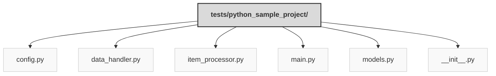

Previously, we looked at [Architecture Diagrams](07_diagrams.md).

# Code Inventory: python_sample_project
## File Structure

## File Descriptions Summary
*   **`config.py`**: """Configuration settings for the Sample Project 2.
*   **`data_handler.py`**: """Handle data loading and saving operations for Sample Project 2.
*   **`item_processor.py`**: Contain the logic for processing Item objects in Sample Project 2.
*   **`main.py`**: """Main execution script for Sample Project 2.
*   **`models.py`**: """Data models for Sample Project 2.
*   **`__init__.py`**: tests/sample_project2/__init__.py
---
## Detailed File Content
##
###### 1) tests/python_sample_project/
#  config.py
... Configuration settings for the Sample Project 2.
*   **`def get_data_path() -> str:`**
    ... Return the configured path for the data file.
*   **`def get_threshold() -> int:`**
    ... Return the configured processing threshold.
---
##
###### 2) tests/python_sample_project/
#  data_handler.py
... Handle data loading and saving operations for Sample Project 2.
### **`class DataHandler()`**
... Manage loading and saving Item data.
#### *Class variables:*
*   **`_data_source: str`**
#### *Methods:*
*   **`def __init__(self: "DataHandler", data_source_path: str) -> None:`**
    ... Initialize the DataHandler with the path to the data source.
*   **`def load_items(self: "DataHandler") -> list["Item"]:`**
    ... Simulate loading items from the data source.
*   **`def save_items(self: "DataHandler", items: list["Item"]) -> bool:`**
    ... Simulate saving processed items back to the data source.
---
##
###### 3) tests/python_sample_project/
#  item_processor.py
... Contain the logic for processing Item objects in Sample Project 2.
### **`class ItemProcessor()`**
... Process individual Item objects based on configured rules.
#### *Class variables:*
*   **`_threshold: int`**
#### *Methods:*
*   **`def __init__(self: "ItemProcessor", threshold: int) -> None:`**
    ... Initialize the ItemProcessor with a processing threshold.
*   **`def process_item(self: "ItemProcessor", item: "Item") -> bool:`**
    ... Process a single item.
---
##
###### 4) tests/python_sample_project/
#  main.py
... Main execution script for Sample Project 2.
*   **`def run_processing_pipeline() -> None:`**
    ... Execute the main data processing pipeline.
*   **`def setup_main_logging() -> None:`**
    ... Set up basic logging for the main script execution.
---
##
###### 5) tests/python_sample_project/
#  models.py
... Data models for Sample Project 2.
**`@dataclass`**
### **`class Item()`**
... Represent a single data item to be processed.
#### *Class variables:*
*   **`item_id: int`**
*   **`name: str`**
*   **`processed: bool`**
*   **`value: float`**
#### *Methods:*
*   **`def __str__(self: "Item") -> str:`**
    ... Return a user-friendly string representation of the item.
*   **`def mark_as_processed(self: "Item") -> None:`**
    ... Set the processed flag to True.
---
##
###### 6) tests/python_sample_project/
#  __init__.py
... Initializes the sample_project2 package.
---

Next, we will examine [Project Review](09_project_review.md).

---

*Generated by [SourceLens AI](https://github.com/darijo2yahoocom/sourceLensAI) using LLM: `gemini` (cloud) - model: `gemini-2.0-flash` | Language Profile: `Python`*