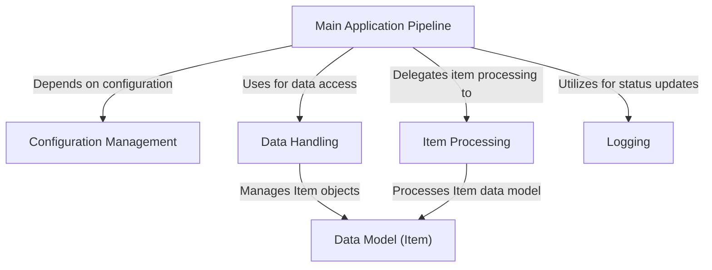

# Tutorial: python_sample_project

The `python_sample_project` processes data items by first loading them using **Data Handling** based on *Configuration Management*.  Then, the **Item Processing** component transforms the loaded items. Finally, the processed data may be saved back using **Data Handling**, with **Logging** recording the whole process.

**Source Directory:** `C:\_jd_programming\python\11_sourceLens_project\sourceLens\tests\python_sample_project`

## Abstraction Relationships

## Chapters

1. [Configuration Management](01_configuration-management.md)
2. [Data Model (Item)](02_data-model-item.md)
3. [Data Handling](03_data-handling.md)
4. [Item Processing](04_item-processing.md)
5. [Logging](05_logging.md)
6. [Main Application Pipeline](06_main-application-pipeline.md)
7. [Architecture Diagrams](07_diagrams.md)
8. [Code Inventory](08_code_inventory.md)
9. [Project Review](09_project_review.md)

---

*Generated by [SourceLens AI](https://github.com/darijo2yahoocom/sourceLensAI) using LLM: `gemini` (cloud) - model: `gemini-2.0-flash` | Language Profile: `python`*