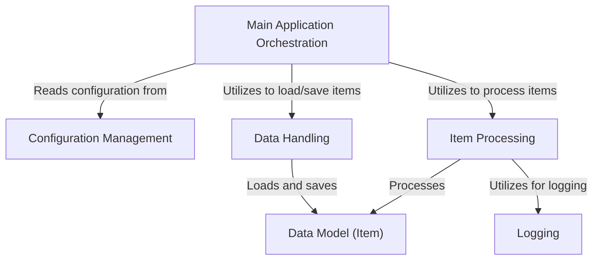

# Tutorial: python_sample_project

The `python_sample_project` orchestrates data processing through several key components. First, **Configuration Management** provides settings to other parts. Then, the *Data Handling* component loads `Item` data based on this configuration, and `Item Processing` modifies those items. The `Main Application Orchestration` component ties everything together by initializing components, loading data, processing, and saving.

**Source Directory:** `C:\_jd_programming\python\11_sourceLens_project\sourceLens\tests\python_sample_project`

## Abstraction Relationships

## Chapters

1. [Configuration Management](01_configuration-management.md)
2. [Data Model (Item)](02_data-model-item.md)
3. [Data Handling](03_data-handling.md)
4. [Logging](04_logging.md)
5. [Item Processing](05_item-processing.md)
6. [Main Application Orchestration](06_main-application-orchestration.md)
7. [Architecture Diagrams](07_diagrams.md)
8. [Code Inventory](08_code_inventory.md)
9. [Project Review](09_project_review.md)

---

*Generated by [SourceLens AI](https://github.com/darijo2yahoocom/sourceLensAI) using LLM: `gemini` (cloud) - model: `gemini-2.0-flash` | Language Profile: `Python`*